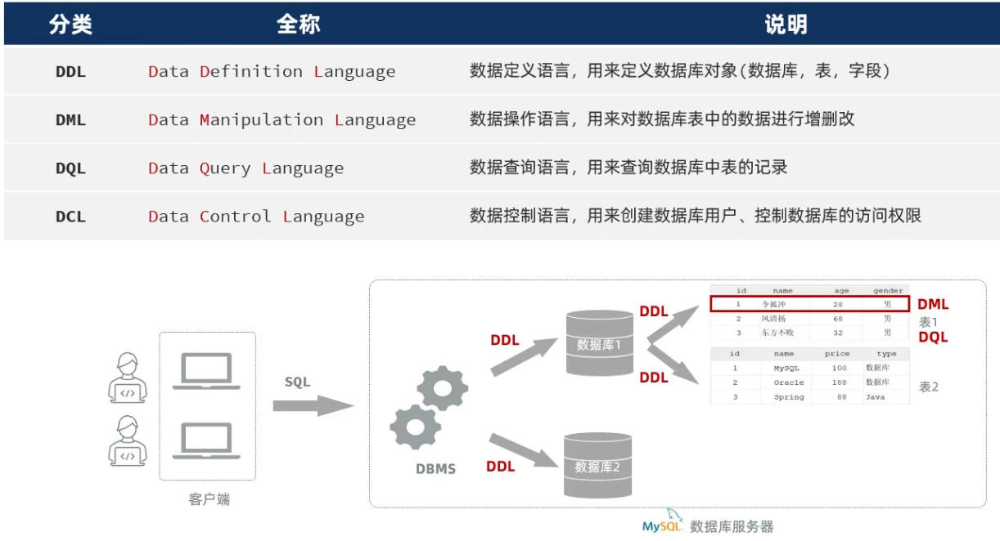

+++
title = 'Java Web'
date = 2025-09-13T09:48:39+08:00
draft = false
categories = ['指令语法']
+++

## 协议
### HTTP 方法
- GET：请求指定资源，获取数据。参数附加在URL后，长度有限制，不适合传输敏感信息
- POST：向指定资源提交数据，通常用于表单提交。参数放在请求体中，无长度限制
- PUT：向指定资源上传数据，通常用于更新资源的全部内容
- DELETE：删除指定资源
- HEAD：类似于GET请求，但只返回响应头，不返回响应体。用于检查资源是否存在或获取元数据
常见状态码（200、301、302、404、500）: 2xx表示成功，3xx表示重定向，4xx表示客户端引发的错误，5xx表示服务器端引发的错误

### RESTful 风格
- 资源（Resource）：通过**URL表示资源**，如`/users`表示用户资源
- HTTP 方法：使用不同的**HTTP方法操作资源**，如GET获取资源，POST创建资源，PUT更新资源，DELETE删除资源
- 无状态（Stateless）：每个请求都应包含所有必要的信息，服务器不应存储客户端的状态
- 统一接口（Uniform Interface）：通过标准化的接口与资源进行交互，如使用JSON或XML格式进行数据交换

### 请求协议
- 请求行、请求头
目标主机名、浏览器版本、接受的文件类型
```http
GET /index.html HTTP/1.1 // 第一行为请求行
Host: www.example.com
User-Agent: Mozilla/5.0
Accept: text/html
```
- 请求体
与请求头之间有一个空行分隔。  
只有POST请求才会携带请求体，包含提交的数据，大小无限制

```java
@RestController // 将controller的返回值作为响应体返回
public class PostController {
    @PostMapping("/submit")
    public String handleSubmit(@RequestBody String body) {
        return "Received data: " + body;
    }
}
```

### 响应协议
```http
HTTP/1.1 200 OK
Content-Type: text/html
Content-Length: 1234
```
- URL 组成

- 协议（Protocol）：如 `http`、`https`
- 域名（Domain）：如 `www.example.com`
- 路径（Path）：如 `/index.html`
- 查询参数（Query）：如 `?id=123&name=abc`
- 端口（Port）：如 `:80`（HTTP默认端口）、`:443`（HTTPS默认端口）
- 锚点（Fragment）：如 `#section1`

```java
@RestController
// 方式一：Spring提供的ResponseEntity类
public class ResponseController {
    @GetMapping("/data")
    public ResponseEntity<String> getData() {
        HttpHeaders headers = new HttpHeaders();
        headers.add("Custom-Header", "CustomValue");
        return ResponseEntity.status(HttpStatus.OK).headers(headers).body("Response Body");// 通常只手动设置响应体
    }
}
// 方式二：使用HttpServletResponse对象
public class ResponseController {
    @GetMapping("/data")
    public void getData(HttpServletResponse response) throws IOException {
        response.setHeader("Custom-Header", "CustomValue");
        response.setStatus(HttpServletResponse.SC_OK);
        response.getWriter().write("Response Body");
    }
}
```

## Web前端
### HTML 基础
基本结构示例：
```html
<!DOCTYPE html>
<html lang="en">
<head>
    <meta charset="UTF-8">
    <meta name="viewport" content="width=device-width, initial-scale=1.0">
    <title>Document</title>
</head>
<body>

</body>
</html>
```
标签不区分大**小**写，属性值用单**双**引号均可

#### 常用标签
- 标题标签：`<h1>`到`<h6>`
- 段落标签：`<p>`
- 链接标签：`<a href="https://example.com" target="_blank">Example</a>`  
  链接地址使用`href`属性，打开方式使用target属性（_blank新窗口打开，_self当前窗口打开）   
- 图像标签：``  
  图像地址使用`src`属性，`alt`属性用于图像无法显示时的替代文本
- 列表标签：`<ul>`、`<ol>`、`<li>`
- 表格标签：`<table>`、`<tr>`、`<td>`、`<th>`
- 表单标签：`<form>`、`<input>`、`<textarea>`

#### CSS
- 内联样式：使用`style`属性直接在HTML标签中定义样式
- 内部样式表：使用`<style>`标签在HTML文档的`<head>`部分定义样式
- 外部样式表：使用`<link>`标签链接外部CSS文件

```html
<link rel="stylesheet" href="styles.css">
</code>
```
CSS选择器
- 元素选择器：选择所有指定的元素，例如`p`选择所有段落
- 类选择器：选择所有指定类的元素，例如`.className`选择所有类名为className的元素
- ID选择器：选择指定ID的元素，例如`#idName`选择ID为idName的元素
- 属性选择器：选择具有指定属性的元素，例如`[type="text"]`选择所有type属性为text的输入框
```css
p {font-size: 16px;}
[class="highlight"] {color: red;}
#header {background-color: blue;}
[type="text"] {background-color: lightyellow;}
```

### JavaScript 基础
1. 引入方式
```html
<script src="script.js"></script>
```
2. JSON格式：
```json
{
  "name": "John",
  "age": 30,
  "isStudent": false,
  "courses": ["Math", "Science"],
  "address": {
    "street": "123 Main St",
    "city": "Anytown"
  }
}
```
3. DOM（文档对象模型）
是HTML和XML文档的JS编程接口。它将文档表示为一个树结构，其中每个节点表示文档的一部分（例如元素、属性或文本）。

- **访问节点**：通过`document`对象访问文档中的元素，例如`document.getElementById()`、`document.querySelector('选择器')`。
- **修改节点**：可以更改节点的内容、属性或样式，例如`element.innerHTML`、`element.style`。
- **事件处理**：可以为节点添加事件监听器，例如`element.addEventListener("click", function)`。
- **创建和删除节点**：可以动态添加或移除文档中的元素，例如`document.createElement()`、`parentNode.appendChild()`、`parentNode.removeChild()`。

```javascript
document.getElementById("myElement").innerText = "Hello, World!";
```

4. 事件监听
```javascript
document.getElementById("myButton").addEventListener("click", function() {
    alert("Button clicked!");
});
```
常见事件类型：
- 鼠标事件：click、dblclick、mouseenter、mouseleave
- 键盘事件：keydown键盘按下、keyup键盘抬起、keypress
- 表单事件：submit表单提交、change值改变、focus获得焦点、blur失去焦点

### Vue
Vue 是一个用于构建用户界面的渐进式 JavaScript 框架。它的核心库专注于视图层，易于上手，并与其他库或现有项目轻松集成。

Element组件网址：https://element-plus.org/

1. 项目管理命令
- 创建项目：`npm init vue@latest`
- 安装依赖：`npm install`
- 运行项目：`npm run dev`

2. 基础格式
```html
<script src="https://unpkg.com/vue@3/dist/vue.global.js"></script>
<div id="app">
  {{ message }}
</div>
<script>
  const app = Vue.createApp({
    data() {
      return {
        message: 'Hello Vue!'
      }
    }
  });
  app.mount('#app');// 将 Vue 应用挂载到具有 id "app" 的 DOM 元素上
</script>
```

3. 常用函数
- `v-for`: 列表渲染
- `v-bind`: 动态绑定 HTML 属性
- `v-model`: 创建双向数据绑定
- `v-if` / `v-else-if` / `v-else`: 条件渲染（是否创建）
- `v-show`: 条件显示（创建后选择是否显示）
- `v-on`: 事件监听

4. 生命周期钩子函数
- `created`: 实例创建后调用
- `mounted`: 实例挂载到 DOM 后调用
- `updated`: 数据更新后调用

#### VueRouter
Vue Router 是 Vue.js 的官方路由管理器，定义路径与组件之间的对应关系。

- <router-link>：请求链接组件，浏览器会解析成<a>
- <router-view>：动态视图组件，用来渲染展示与路由路径对应的组件

### AJAX
在不重新加载整个网页的情况下，与服务器交换数据并更新部分网页内容。

基本使用示例：
```javascript
<script src="https://unpkg.com/axios/dist/axios.min.js"></script>
axios.get('https://api.example.com/data')
  .then(function (response) {// then异步处理成功回调
    console.log(response.data);
  })
  .catch(function (error) {
    console.error('Error fetching data:', error);
  });
```

async/await 语法：
将异步代码变成同步
```javascript
async function fetchData() {
  try {
    const response = await axios.get('https://api.example.com/data');// await 等待异步操作完成
    console.log(response.data);
  } catch (error) {
    console.error('Error fetching data:', error);
  }
}
fetchData();
```

## Web后端

### 分层解耦
三层架构：控制层Controller（响应前端请求）、业务逻辑层Service（具体处理逻辑）、数据访问层Dao（数据库）

#### IOC（控制反转） DI（依赖注入）
IOC 将对象的创建和依赖关系的管理交给容器，而不是由对象自身；IOC容器中管理的对象称为 Bean。
DI 通过构造器注入、属性注入或接口注入将依赖关系传递给对象。
```java
@Component // 将类标记为Spring管理的IOC组件
public class UserService {
    private final UserRepository userRepository;// 不用显式指定对象类名，会自动查找各实现类

    @Autowired // 通过构造器注入依赖
    public UserService(UserRepository userRepository) {
        this.userRepository = userRepository;
    }
}
```

- @Autowired按类型注入。  
若有多个实现类，对实现类添加@Primary注解指定首选实现类；在@Autowired添加@Qualifier()元注解指定具体实现类。  
- @Resource(name="beanName")按名称注入。

### Maven
Maven 是一个项目管理和构建自动化工具，主要用于 Java 项目。它使用 pom.xml 文件来管理项目的构建、依赖和文档。

- 项目结构
```
my-app
├── pom.xml // 项目对象模型文件，包含项目信息和配置
└── src // 源代码目录
    ├── main
    │   ├── java
    │   │   └── com
    │   │       └── mycompany
    │   │           └── app
    │   │               └── App.java
    │   └── resources // 资源文件目录
    └── test // 测试代码目录
        ├── java
        └── resources
```

- 生命周期
分为三套周期:clean、default、site  
**同一套**生命周期中，运行某个阶段会自动执行该阶段之前的所有阶段。
clean 阶段：
  - `clean`: 清理上一次构建生成的文件
default 阶段：
  - `validate`: 验证项目是否正确且所有必要信息是否可用
  - `compile`: 编译项目的源代码
  - `test`: 运行测试
  - `package`: 将编译后的代码打包成可分发格式
    JAR 普通模块（内嵌tomcat）；WAR Web模块； POM 聚合模块(只用于管理依赖)
  - `install`: 将包安装到本地 Maven 仓库
  - `deploy`: 将最终包复制到远程仓库
site 阶段：
  - `site`: 生成项目的站点文档

#### 继承与聚合
- 继承与聚合的pom.xml文件打包方式均为pom，不生成实际的jar/war包。两者可以共存在同一个pom文件中。
- 聚合与继承均属于设计型模块，并无实际的模块内容

##### 继承
用于简化依赖配置、统一管理依赖。

在父项目中配置共有的依赖，子项目在其 pom.xml 中使用 `<parent>` 标签指定父项目。
```xml
子项目的pom.xml
<parent>
    <groupId>com.example</groupId>
    <artifactId>my-parent</artifactId>
    <version>1.0-SNAPSHOT</version>
    <relativePath>../pom.xml</relativePath>
</parent>
```

对于一些依赖，只在部分子项目中使用。  
因此父项目中不直接引入这些依赖，而是通过 `<dependencyManagement>` 标签统一管理版本，并未直接引入。
此时子项目只需声明依赖而不指定版本号。
```xml
父项目的pom.xml
<dependencyManagement>
<!-- 指定了依赖的版本号，但没有引入依赖 -->
    <dependencies>
        <dependency>
            <groupId>org.springframework.boot</groupId>
            <artifactId>spring-boot-starter-web</artifactId>
            <version>2.5.4</version>
        </dependency>
    </dependencies>
</dependencyManagement>

子项目的pom.xml
<dependencies>
    <dependency>
        <groupId>org.springframework.boot</groupId>
        <artifactId>spring-boot-starter-web</artifactId>
        <!-- 版本号由父项目管理，无需指定 -->
    </dependency>
</dependencies>
```

##### 聚合
将多个模块组织成一个整体，统一进行项目的编译、打包、安装等**构建操作**。  

- 聚合工程：一个不具有业务功能的“空”工程（有且仅有一个pom文件） 【PS：一般来说，继承关系中的父工程与聚合关系中的聚合工程是同一个】

```xml
聚合工程的pom.xml
<modules>
    <module>module-a</module>
    <module>module-b</module>
</modules>
```


### Spring Boot
Spring Boot 是一个用于简化 Spring 应用程序开发的框架。它通过自动配置和约定优于配置的原则，使开发者能够快速创建独立、生产级别的 Spring 应用程序。

#### 基础概念
**常用注解：**
- `@SpringBootApplication`: 标记主类，启用自动配置和组件扫描
- `@RestController`: 标记控制器类，返回 JSON 或 XML 响应
- `@GetMapping`、`@PostMapping`: 处理 GET 和 POST 请求
- `@Service`: 标记服务类，包含业务逻辑
- `@Repository`: 标记数据访问类，处理数据库操作
- `@Autowired`: 自动注入依赖的 Bean

```java
@SpringBootApplication // 标记主类，启用自动配置和组件扫描，项目运行入口
public class MyApplication {
    public static void main(String[] args) {
        SpringApplication.run(MyApplication.class, args);
    }
}
```

#### 配置文件
Spring Boot 使用 application.properties(优先级最高) 或 **application.yml** 文件对应用的配置进行管理。

在启动程序下拉栏的“Edit Configurations...”中可以设置系统属性(-Dserver.port=9000)和命令行参数(--server.port=9001)。

```properties
server.port=8081 // 设置服务器端口
spring.datasource.url=jdbc:mysql://localhost:3306/dbname // 数据库连接URL
spring.datasource.username=root // 数据库用户名
spring.datasource.password=your_password // 数据库密码
```

yml中，**冒号后必须有空格**；缩进表示层级关系，空格个数不限，但同层级必须统一。
```yml
server:
  port: 8081 // 设置服务器端口
spring:
  datasource:
    url: jdbc:mysql://localhost:3306/dbname // 数据库连接URL
    username: root // 数据库用户名
    password: your_password // 数据库密码
```

#### 全局异常处理
```java
@RestControllerAdvice //表示当前类是全局异常处理器
//相当于@ControllerAdvice + @ResponseBody，将异常处理方法返回值转换为json后响应给前端
public class GlobalExceptionHandler {
    //处理异常
    @ExceptionHandler
    public Result ex(Exception e){//方法形参中指定能够处理的异常类型
        e.printStackTrace();//打印堆栈中的异常信息
        return Result.error("对不起,操作失败,请联系管理员");//捕获异常后使用result类进行响应
    }
}
```

#### Bean 组件
使用 **注解@Component** 以及它的三个衍生注解（@Controller、@Service、@Repository）来声明IOC容器中的bean对象。

1. 作用域：
Spring中的bean默认是单例的（singleton），可以通过注解@Scope设置作用域。
- singleton（单例，默认值）：IOC容器中只创建一个共享的Bean实例
- prototype（原型）：每次请求都会创建一个新的Bean实例

- request：每个HTTP请求创建一个新的Bean实例（仅适用于Web应用）
- session：每个HTTP会话创建一个新的Bean实例（仅适用于Web应用）
- application：在ServletContext范围内创建一个Bean实例（仅适用于Web应用）

2. 第三方Bean
使用注解 **@Configuration** 和 **@Bean** 来定义和注册第三方类的Bean。
```java
@Configuration // 标记当前类为配置类，集中管理Bean定义
public class MyConfig {
    @Bean
    public MyThirdPartyService1 myThirdPartyService1() {
        return new MyThirdPartyService1();
    }

    @Bean
    public MyThirdPartyService2 myThirdPartyService2() {
        return new MyThirdPartyService2();
    }
}
```

##### 自定义starter
将某个技术的依赖 + 配置 + Bean 的自动注入全部封装起来，用户只需引入对应的 starter 坐标就能开箱即用。

1. 创建一个新的 Maven 项目，命名为 `exp-spring-boot-starter`，只包含pom.xml。
    在 `pom.xml` 中添加所需的依赖和插件，并引入第二点的自动配置模块。

2. 创建自动配置module，并编写自动配置类
```java
@Configuration
public class MyAutoConf {
    @Bean
    @ConditionalOnMissingBean // 当容器中没有指定类型的Bean时，才创建该Bean
    public MyService myService() {
        return new MyService();
    }
}
```

3. 在 `src/main/resources/META-INF/spring.factories` 文件中**注册自动配置类**
```
org.springframework.boot.autoconfigure.EnableAutoConfiguration=\
com.example.autoconfiguration.MyAutoConf
```

4. 使用：在配置文件中引入依赖`exp-spring-boot-starter`，即可在项目中直接 @Autowired 使用。
```java
@Autowired
private MyService myService;
```

##### *导入第三方依赖Bean
- 使用 @ComponentScan 扫描指定包路径下的类并注册为Bean。（使用繁琐、性能低）
- 使用 **@Import** 导入普通类或配置类或对应的实现类。
```java
import org.springframework.context.annotation.Import;

@Import(MyConfig.class) // 导入配置类
@SpringBootApplication // 主类
public class MyApplication {
    public static void main(String[] args) {
        SpringApplication.run(MyApplication.class, args);
    }
}
```
- 使用第三方依赖提供的 @Enable 开启特定功能并注册相关Bean。
```java
import org.springframework.context.annotation.EnableAspectJAutoProxy;

@EnableAspectJAutoProxy // 开启AOP功能
@SpringBootApplication // 主类
public class MyApplication {
    public static void main(String[] args) {
        SpringApplication.run(MyApplication.class, args);
    }
}
```


### MySQL


#### DDL（数据定义语言）
数据库：
- 查询数据库：`SHOW DATABASES;`
  查询当前使用的数据库：`SELECT DATABASE();`
- 创建数据库：`CREATE DATABASE dbname;`
- 删除数据库：`DROP DATABASE dbname;`
- 使用数据库：`USE dbname;`

表：
- 创建表：`CREATE TABLE tablename (column1_name datatype 约束, column2_name datatype, ...);`
- 删除表：`DROP TABLE tablename;`
- 查看建表指令：`SHOW CREATE TABLE tablename;`
- 查看表结构：`DESCRIBE tablename;` 或 `SHOW COLUMNS FROM tablename;`
- 修改表：
  `ALTER TABLE tablename ADD column_name datatype;`（添加列）  
  `ALTER TABLE tablename DROP COLUMN column_name;`（删除列）  
  `ALTER TABLE tablename MODIFY COLUMN column_name new_datatype;`（修改列数据类型）
- 修改表名：`RENAME TABLE old_tablename TO new_tablename;`
- 删除表：`DROP TABLE tablename;`


示例：
```sql
CREATE TABLE users (
  id INT PRIMARY KEY AUTO_INCREMENT comment '用户ID自增',
  username VARCHAR(50) NOT NULL,
  email VARCHAR(100) NOT NULL,
  created_at TIMESTAMP DEFAULT CURRENT_TIMESTAMP
) comment='用户表';
```

#### DML（数据操作语言）
- 插入数据：`INSERT INTO tablename (column1, column2, ...) VALUES (value1, value2, ...),(value1, value2, ...);`
- 更新数据：`UPDATE tablename SET column1 = value1, column2 = value2, ... WHERE condition;`
- 删除数据：`DELETE FROM tablename WHERE condition;`

#### DQL（数据查询语言）
- 基本查询：`SELECT column1, column2, ... FROM tablename;`
  通配符`*`表示查询所有列
  为查询字段设置别名：`SELECT column AS alias FROM tablename;`
  去重：`SELECT DISTINCT column FROM tablename;`

- 条件查询：`SELECT * FROM tablename WHERE column = value;`
  范围查询：`SELECT * FROM tablename WHERE column BETWEEN value1 AND value2;`
  in查询：`SELECT * FROM tablename WHERE column IN (value1, value2, ...);`
  like模糊查询：`SELECT * FROM tablename WHERE column LIKE 'pattern';`
    *pattern中%表示任意字符序列，_表示单个任意字符*

- 分组查询：`SELECT column, COUNT(*) FROM tablename GROUP BY column;`
  HAVING 子句总是出现在GROUP BY之后，用于过滤分组后的结果，是唯一可以在过滤条件中使用聚合函数（如 COUNT(), SUM(), AVG(), MAX(), MIN()）的子句
- 例：`SELECT salary, COUNT(*) FROM users where salary > 3000 group by salary having COUNT(*) > 2;`
  查询工资高于3000且人数超过2人的工资情况。
- 排序查询：`SELECT * FROM tablename ORDER BY column ASC|DESC;`
- 分页查询：`SELECT * FROM tablename LIMIT offset, row_count;`

**执行顺序**：FROM -> WHERE -> GROUP BY -> HAVING -> SELECT -> ORDER BY -> LIMIT
            选取表 -> 过滤行 -> 分组 -> 过滤组 -> 选择列 -> 排序 -> 分页

### JDBC
Java Database Connectivity 是用于连接和操作关系型数据库的API，是其它 ORM 框架（如 Hibernate、MyBatis）的实现基础。
```java
Class.forName("com.mysql.cj.jdbc.Driver");// 加载MySQL JDBC驱动程序
Connection connection = DriverManager.getConnection("jdbc:mysql://localhost:3306/dbname", "username", "password");// 建立连接
Statement statement = connection.createStatement();// 创建Statement对象

// DML 示例：插入数据
int rowsAffected = statement.executeUpdate("INSERT INTO tablename (column1, column2) VALUES ('value1', 'value2');");// 返回受影响的行数

// DQL方式1 通过Statement执行
ResultSet resultSet = statement.executeQuery("SELECT id, name FROM tablename WHERE id = ? AND name = ?;");

// DQL方式2 PreparedStatement 预编译查询
PreparedStatement pStatement = connection.prepareStatement("SELECT id, name FROM tablename WHERE id = ? AND name = ?;");// 预编译sql语句，？表示占位符
pStatement.setInt(1, 1);// 设置第一个占位符的值
pStatement.setString(2, "John");
ResultSet resultSet = pStatement.executeQuery();

while (resultSet.next()) {
    String columnValue = resultSet.getString("column_name");// 获取列值
}
resultSet.close();// 关闭ResultSet
statement.close();// 关闭Statement
connection.close();// 关闭Connection
```

### MyBatis
通过XML或注解 将SQL语句与Java方法映射，实现对象与数据库之间的映射。

Mybatis中封装查询结果:
- 如果查询返回的字段名与实体的属性名可以直接对应上，用resultType 。
- 如果查询返回的字段名与实体的属性名对应不上，或实体属性比较复杂，可以通过resultMap手动封装 。
```xml
<!--自定义结果集ResultMap-->
<resultMap id="empResultMap" type="com.itheima.pojo.Emp">
    <id column="id" property="id" />
    <result column="name" property="name" />
    <result column="dept_id" property="deptId" />
    <result column="create_time" property="createTime" />
    <result column="update_time" property="updateTime" />

    <!--封装工作经历exprList-->
    <collection property="exprList" ofType="com.itheima.pojo.EmpExpr">
        <id column="exp_id" property="id"/>
        <result column="exp_company" property="company"/>
        <result column="exp_empid" property="empId"/>
    </collection>
</resultMap>

<!--根据ID查询信息，查询结果封装指向自定义结果集-->
<select id="getById" resultMap="empResultMap">
    select e.*,
        exp.id exp_id,
        exp.emp_id exp_empid,
        exp.company exp_company
    from emp e left join emp_expr exp on e.id = exp.emp_id
    where e.id = #{id}
</select>
```

#### 持久层接口
```java
@Mapper // 标记为MyBatis的Mapper接口
public interface UserMapper {// 命名为XxxMapper
    @Select("SELECT * FROM users WHERE id = #{id}") // 使用注解方式定义SQL
    User getUserById(int id);

    @Insert("INSERT INTO users (username, email) VALUES (#{username}, #{email})")
    void insertUser(User user);
}
```

#### 数据操作
```java
// 类定义
@Mapper
public interface UserMapper {
  @Select("SELECT * FROM users WHERE id = #{id}")
  public User getUserById(int id);// 根据ID查询用户

  @Insert("INSERT INTO users (username, email) VALUES (#{username}, #{email})")
  public void insertUser(User user);// 增加用户

  @Delete("DELETE FROM users WHERE id = #{id}")
  public void deleteUser(int id);// 删除用户

  @Update("UPDATE users SET email = #{email} WHERE id = #{id}")
  public void updateUser(@Param("id") int id, String email);// 更新用户邮箱
  // 非官方骨架中，若有多个形参需要使用@Param注解指定参数名与sql语句对应
}

// 使用示例
@Autowired
private UserMapper userMapper;
public void exampleUsage() {
    User user = userMapper.getUserById(1);// 查询用户
    userMapper.insertUser(new User("newUser", "newuser@example.com"));// 增
    userMapper.deleteUser(2);// 删
    userMapper.updateUser(3, "updated@example.com");// 改
}
```
### 多表关系

#### 外键约束(物理)
- 创建外键：`ALTER TABLE 子表名 ADD CONSTRAINT 外键名 FOREIGN KEY (column_name) REFERENCES 父表名(parent_column);`
  建表时创建：[CONSTRAINT] 外键名 FOREIGN KEY (column_name) REFERENCES 父表名(parent_column)，应位于表定义的最后。
- 删除外键：`ALTER TABLE 子表名 DROP FOREIGN KEY 外键名;`

**多对多关系**
通过建立第三张中间表，中间表至少包含两个外键，分别关联两方主键。
```sql
CREATE TABLE students (
  id INT PRIMARY KEY AUTO_INCREMENT,
  name VARCHAR(100) NOT NULL
);
CREATE TABLE courses (
  id INT PRIMARY KEY AUTO_INCREMENT,
  title VARCHAR(100) NOT NULL
);
CREATE TABLE student_courses (
  student_id INT,
  course_id INT,
  PRIMARY KEY (student_id, course_id),
  FOREIGN KEY (student_id) REFERENCES students(id),
  FOREIGN KEY (course_id) REFERENCES courses(id)
);
```

#### 多表查询
##### 内连接
查询多表中交集部分的记录，即满足连接条件的记录。
```sql
SELECT 字段列表 FROM 表1 [INNER] JOIN 表2 ON 连接条件 ... ;
```
- 一对一：`SELECT * FROM table1 JOIN table2 ON table1.id = table2.id;`
- 一对多：`SELECT * FROM table1 JOIN table2 ON table1.id = table2.table1_id;`
- 多对多：`SELECT * FROM table1 JOIN table2 ON table1.id = table2.table1_id JOIN table3 ON table2.table3_id = table3.id;`

##### 外连接
查询多表中交集部分及非交集部分的记录。
- 左外连接（LEFT JOIN）：返回左表的所有记录及右表中匹配的记录
```sql
SELECT 字段列表 FROM 表1 LEFT JOIN 表2 ON 连接条件 ... ;
```
- 右外连接（RIGHT JOIN）：返回右表的所有记录及左表中匹配的记录
```sql
SELECT 字段列表 FROM 表1 RIGHT JOIN 表2 ON 连接条件 ... ;
```

##### 子查询
在一个查询语句中嵌套另一个查询语句。

**示例**
```sql
SELECT 字段列表 FROM 表名 WHERE 列名 OPERATOR (子查询);

-- 示例：查询所有选修了课程ID为1的学生
SELECT * FROM students WHERE id IN (SELECT student_id FROM student_courses WHERE course_id = 1);

-- 查询每个部门中薪资最高的员工信息
SELECT * FROM emp e, (SELECT dept_id, MAX(salary) max_sal FROM emp GROUP BY dept_id) x WHERE e.dept_id = x.dept_id AND e.salary = x.max_sal;

-- 查询员工所属部门名称及员工人数超过10人的部门名称，e.dept_id = d.id用于约束两表的连接关系
SELECT d.name FROM emp AS e, dept AS d WHERE e.dept_id = d.id GROUP BY d.name HAVING COUNT(*) > 10;

-- 查询工资 低于本部门平均工资 的员工信息 。
SELECT e.* FROM emp e, (SELECT dept_id, AVG(salary) avg_sal FROM emp GROUP BY dept_id) AS x
WHERE e.dept_id = x.dept_id AND e.salary < x.avg_sal;
```

##### 优化
1. 实体类传递参数，避免逐个参数传递
```java
public class EmpQuery {
    private String name;
    private Integer gender;
    private Date begin;
    private Date end;
    // 省略getter和setter
}
@Mapper
public interface EmpMapper {
    List<Emp> list(EmpQuery empQuery);// 会自动将empQuery对象的属性映射到SQL语句中的参数（名称需要一致）
}

```
2. 动态SQL
```xml
<!DOCTYPE mapper
        PUBLIC "-//mybatis.org//DTD Mapper 3.0//EN"
        "http://mybatis.org/dtd/mybatis-3-mapper.dtd">
<mapper namespace="com.itheima.mapper.EmpMapper">
    <select id="list" resultType="com.itheima.pojo.Emp">
        select e.*, d.name deptName from emp as e left join dept as d on e.dept_id = d.id
        <where>
            <if test="name != null and name != ''">
                e.name like concat('%',#{name},'%')
            </if>
            <if test="gender != null">
                and e.gender = #{gender}
            </if>
            <if test="begin != null and end != null">
                and e.entry_date between #{begin} and #{end}
            </if>
        </where>
    </select>
</mapper>
```
<if>：条件成立则进行拼接。
<where>：根据查询条件生成where关键字，并会自动去除条件前面多余的and或or（若不去除，则无name，有gender时会多出一个and）

### 事务管理
事务（Transaction）是一组操作的集合，这些操作要么全部成功，要么全部失败，保持数据的一致性和完整性。事务具有四个基本特性，简称为ACID特性：
- 原子性（Atomicity）：事务中的所有操作要么全部完成，要么全部不完成。
- 一致性（Consistency）：事务执行前后，数据库必须保持一致的状态。执行中可能会有中间状态，但最终不论成败都会回到一致性状态。
- 隔离性（Isolation）：并发执行的*事务之间*相互隔离，互不干扰。
- 持久性（Durability）：一旦事务提交，其结果是永久性的，即使系统崩溃也不会丢失。

MySQL的事务默认是自动提交的。当执行一条DML语句，MySQL会立即隐式的提交事务。

#### 使用方式
1. SQL
```sql
-- 开启事务
start transaction; / begin;
-- 1. 保存员工基本信息
insert into emp values (39, 'Tom', '123456', '汤姆', 1, '13300001111', 1, 4000, '1.jpg', '2023-11-01', 1, now(), now());
-- 2. 保存员工的工作经历信息
insert into emp_expr(emp_id, begin, end, company, job) values (39,'2019-01-01', '2020-01-01', '百度', '开发'), (39,'2020-01-10', '2022-02-01', '阿里', '架构');
-- 提交事务(全部成功)
commit;
-- 回滚事务(有一个失败)
rollback;
```

2. **@Transactional** 注解:在当前方法（类、接口）执行之前开启事务，方法执行完毕之后提交事务,若执行出现异常则回滚事务。

- 默认情况下，只有出现RuntimeException(运行时异常)才会回滚事务。
- 当抛出 Exception（编译时异常）或其子类时默认不回滚，除非手动配置 @Transactional(**rollbackFor = Exception.class**)

3. 事务的传播行为
- REQUIRED（默认）：如果已存在事务，则加入；如果没有，则创建新事务。
- REQUIRES_NEW：无论有无，总是创建新事务；如果存在事务，则将当前事务挂起

### 登录认证
本质是根据用户名和密码查询员工信息。

HTTP协议是无状态协议，每次请求都是独立的，服务器不会自动记住用户的登录状态。因此需要在每次请求时都进行登录校验。    
常见的登录校验方法有：
**会话技术：**
1. Cookie
2. Session
3. Token

**统一拦截：** 通过拦截器统一处理登录校验逻辑，简化代码重复性，提高可维护性。
1. 过滤器（Filter）
2. 拦截器（Interceptor）

#### 会话技术
1. Cookie
- **客户端**存储少量数据（如Session ID），每次请求时浏览器会自动携带Cookie信息。  
客户端第一次请求服务器时，服务器自动创建一个Cookie，并将其发送给客户端浏览器。  
浏览器会将Cookie保存下来，并在后续的每次请求中自动携带该Cookie信息发送给服务器。  

HTTP 协议提供了一个响应头和请求头：
- 响应头 Set-Cookie ：设置Cookie S->C
- 请求头 Cookie：携带Cookie C->S

特点：
- HTTP原生支持
- 安全性较低，能在客户端被篡改
- 不能跨域
- 无法在移动端使用

2. Session（会话）
- **服务器端**存储用户的登录状态信息，每个用户对应一个Session对象。
当客户端第一次请求服务器时，服务器会创建一个Session对象，并生成一个唯一的Session ID。  
服务器将Session **ID**通过Cookie发送给客户端，客户端在后续请求中携带该Cookie信息。服务器通过Session ID识别用户的登录状态。

特点：
- 集群环境下，Session信息需要共享，增加复杂性
- 底层基于Cookie实现，存在相同的安全性问题，只是将数据存储在服务器端相对安全

3. Token（令牌）
- **客户端**在登录成功后，服务器生成一个唯一的令牌，并将其返回给客户端。  
客户端后续请求的请求头中需包含令牌，服务器通过校验令牌的有效性识别登录状态。

特点：
- 无状态，适合分布式系统
- 支持移动端
- 支持跨域
- 但校验算法需要自行设计

##### JWT（JSON Web Token）
对原始的json数据格式进行安全的封装。  

特点：
- 简洁：是一个简单的字符串（经过BASE64编码）。可以在请求参数或者是请求头当中直接传递。
- 自包含：可以根据需求在jwt令牌中存储自定义的数据内容。

结构：
- 头部（Header）：包含令牌的类型和签名算法
- 载荷（Payload）：包含声明（Claims），即存储的数据
- 签名（Signature）：用于验证令牌的完整性和真实性

#### 统一拦截
1. 过滤器（Filter）
过滤器是 JavaWeb三大组件(Servlet、Filter、Listener)之一。

需要在**项目启动类上**添加注解 **@ServletComponentScan** 开启SpringBoot项目对于Servlet组件的支持。

```java
@WebFilter(urlPatterns = "/*") // 配置过滤器拦截的请求路径
public class DemoFilter implements Filter {
    //初始化方法, web服务器启动, 创建Filter实例时调用, 只调用一次
    public void init(FilterConfig filterConfig) throws ServletException {
        System.out.println("init ...");
    }
    //拦截方法,可以调用多次
    public void doFilter(ServletRequest servletRequest, ServletResponse servletResponse, FilterChain chain) throws IOException, ServletException {
        System.out.println("放行前逻辑.....");
        filterChain.doFilter(servletRequest,servletResponse);// 放行方法
        System.out.println("放行后逻辑.....");// 访问完资源还会回到过滤器中
    }
    //销毁方法, web服务器关闭时调用, 只调用一次
    public void destroy() {
        System.out.println("destroy ... ");
    }
}
```
过滤器链的执行顺序：对于通过注解配置的Filter，优先级是过滤器类名的自然排序。

2. 拦截器（Interceptor）
拦截器是 Spring MVC 提供的一种机制，用于在请求处理之前和之后执行特定的逻辑。

```java
//自定义拦截器，托管给Spring容器管理
@Component
public class DemoInterceptor implements HandlerInterceptor {
    //目标资源方法执行前执行   
    @Override
    public boolean preHandle(HttpServletRequest request, HttpServletResponse response, Object handler) throws Exception {
        System.out.println("preHandle .... ");
        
        return true; //true表示放行；返回false：不放行
    }

    //目标资源方法执行后执行
    @Override
    public void postHandle(HttpServletRequest request, HttpServletResponse response, Object handler, ModelAndView modelAndView) throws Exception {
        System.out.println("postHandle ... ");
    }

    //渲染完毕后执行，最后执行
    @Override
    public void afterCompletion(HttpServletRequest request, HttpServletResponse response, Object handler, Exception ex) throws Exception {
        System.out.println("afterCompletion .... ");
    }
}
```

#### 获取当前登录用户的信息
- 通过Filter或Interceptor拦截请求后，如何将请求头中信息传递给业务逻辑层？  
在同一个线程/同一个请求中，使用ThreadLocal进行数据共享。

```java
public class LocalContent {
    // 创建ThreadLocal对象，用于存储当前请求的信息
    private static final ThreadLocal<Integer> CURRENT_LOCAL = new ThreadLocal<>();
    // 记录、读取信息的方法
    public static void setCurrentId(Integer employeeId) {
        CURRENT_LOCAL.set(employeeId);
    }
    public static Integer getCurrentId() {
        return CURRENT_LOCAL.get();
    }
    public static void remove() {
        CURRENT_LOCAL.remove();
    }
}

// 在拦截器中使用
@Slf4j
@WebFilter(urlPatterns = "/*")
public class TokenFilter implements Filter {
  // ...
  // 获取请求头并解析得到employeeId后
  LocalContent.setCurrentId(employeeId);// 记录数据
  
  filterChain.doFilter(servletRequest, servletResponse);// 放行
  LocalContent.remove();// 请求处理完毕，移除数据
}

// 在业务逻辑层使用
Integer employeeId = LocalContent.getCurrentId();// 读取数据
```


### AOP(面向切面编程)
通俗的理解：将与业务无关的代码（如**日志记录、权限校验、事务管理**等）从业务逻辑中分离出来，在运行时无侵入地实现动态代理，从而实现代码的模块化和复用。

#### 核心概念
- 连接点（Join Point）：程序执行中的特定点，即方法、异常等。
- 切入点（PointCut）：用规则或表达式限定操作连接点的范围。
- 通知（Advice）：在连接点上执行的操作，如前置通知、后置通知、环绕通知等。
- 切面（Aspect）：即通知+切入点。模块化的关注，如日志记录、事务管理等。

```java
@Component //托管给Spring容器管理，才能识别到切面注解
@Aspect //标记为切面类
@Slf4j
public class RecordTimeAspect {

    @Around("execution(* com.hych.service.impl.DeptServiceImpl.*(..))")// 围绕通知，指定切入点表达式
    public Object recordTime(ProceedingJoinPoint pjp) throws Throwable {
        //记录方法执行开始时间
        long begin = System.currentTimeMillis();
        //执行原始方法
        Object result = pjp.proceed();
        //记录方法执行结束时间
        long end = System.currentTimeMillis();
        //计算方法执行耗时
        log.info("方法执行耗时: {}毫秒",end-begin);
        return result;
    }
}
```
@Aspect 注解表示该类是一个**切面类**。
@Around 注解表示**环绕通知**，可以在方法执行前后添加自定义逻辑。
execution(* com.hych.service.impl.DeptServiceImpl.*(..)) 表示**切入点表达式**，匹配 DeptServiceImpl 类中的所有方法。
pjp 为要操作的目标对象。
pjp.proceed() 执行目标对象中被AOP控制的方法，即**连接点**。

#### 通知类型
@Around：环绕通知，在方法执行前后执行。若`pjp.proceed()`方法抛出异常，则后续通知逻辑不再执行。
@Before：前置通知，在方法执行前执行。
@After：后置通知，在方法执行后执行（无论方法是否成功完成）。
@AfterReturning：返回通知，在方法成功执行后执行，**有异常不执行**。
@AfterThrowing：异常通知，在方法抛出异常后执行。

```java
// 除了around，其余四种通知使用格式（调用对象为jp而非pjp）
@Before("execution(* com.itheima.service.*.*(..))")
    public void before(JoinPoint joinPoint){// JoinPoint类是ProceedingJoinPoint的父类
        log.info("before ...");
    }
```

- 不同切面类中通知执行顺序：
对于Before，切面类字母排名靠前的先执行；对于After，切面类字母排名靠前的后执行。  
可通过@Order(Integer)注解指定顺序，按数字顺序规则同上。
```java
@Slf4j
@Component
@Aspect
public class MyAspect1 {
    //前置通知
    @Before
    public void before(JoinPoint joinPoint){log.info("MyAspect1 -> before ...");}
    //后置通知
    @After
    public void after(JoinPoint joinPoint){log.info("MyAspect1 -> after ...");}
}

// MyAspect2 ...

// MyAspect3 ...
```
前置通知执行顺序：MyAspect1 -> MyAspect2 -> MyAspect3
后置通知执行顺序：MyAspect3 -> MyAspect2 -> MyAspect1  

#### 切入点表达式
1. execution
格式：
```java
execution([访问修饰符]  返回值  [包名.类名.]方法名(方法参数) [throws 异常])
```
通配符：
- `*`：匹配任意**单个**符号（类名、方法名、返回值类型），也可以通配名称的一部分（如find*可匹配 findByID）
- `..`：匹配任意数量的参数（包括0个参数）

可使用 && ，||，！组合复杂的切入点表达式。

2. annotation
匹配标注了指定注解的方法或类。
可在选为连接点的方法上添加**自定义注解**。