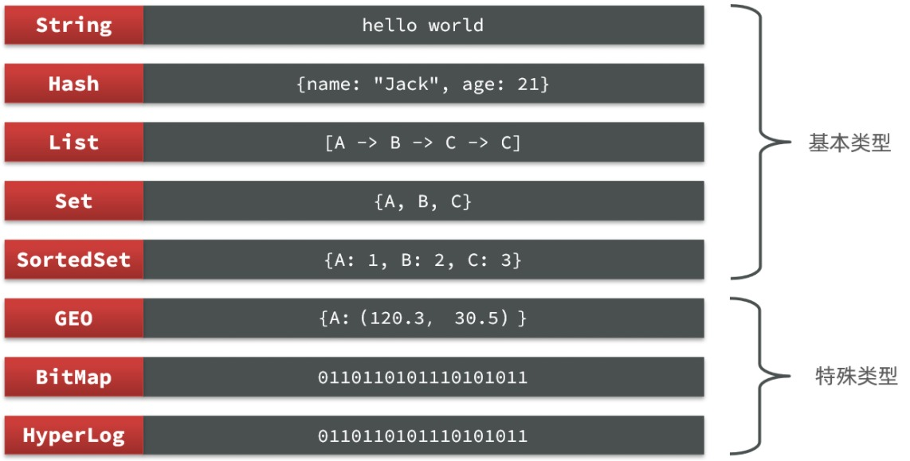

+++
title = 'Redis'
date = 2025-09-13T09:48:39+08:00
draft = false
categories = ["programming"]
+++

## Redis
基于内存的键值型NoSQL数据库，单线程（因此每个命令具有原子性）
- NoSql(Not Only Sql)，不仅仅是SQL，泛指非关系型数据库。

Redis应用场景：缓存、消息队列、任务队列、分布式锁

## 通用命令
|命令|说明|
|---|---|
| `KEYS pattern` | 查找所有符合给定模式(pattern)的key |
| `EXISTS key` | 检查给定key是否存在 |
| `TYPE key` | 返回key所储存的值的类型 |
| `TTL key` | 返回给定key的剩余生存时间(TTL, time to live)，以秒为单位 |
| `DEL key` | 该命令用于在key存在是删除key |

## 数据类型

### String
又细分为普通字符串、整数和浮点数。  
字符串类型的最大空间不超过512MB。

**常用命令：**
|命令|说明|
|---|---|
| `SET key value` | 设置指定key的值为value |
| `GET key` | 获取指定key的值 |
| `MSET key value [key value ...]` | 同时设置一个或多个key-value对 |
| `MGET key [key ...]` | 获取所有给定key的值 |
| `INCR key` | 将key中储存的数字值增一 |
| `DECR key` | 将key中储存的数字值减一 |
| `INCRBY key increment` | 将key中储存的数字值增加指定的增量increment |
| `DECRBY key decrement` | 将key中储存的数字值减少指定的减量decrement |
|---|---|
| `SETNX key value` | 只有在key不存在时，设置key的值为value |
| `SETEX key seconds value` | 将key的值设为value，并将key的生存时间设为seconds秒 |
| `APPEND key value` | 如果key已经存在并且是一个字符串，APPEND命令将value追加到key原来的值的末尾 |
| `STRLEN key` | 返回key所储存的字符串值的长度 |

**KEY结构：**
Redis没有类似MySQL中Table的概念，使用多个单词形成层级结构以区分不同类型的数据。  

prj:user:1	{“id”:1, “name”: “Jack”, “age”: 21}
prj:dish:1	{“id”:1, “name”: “鲟鱼火锅”, “price”: 4999}

### Hash
Hash类型是一个键值对集合，适合用于存储对象。
其value本身是一个键值对集合。

**常用命令：**
|命令|说明|
|---|---|
| `HSET key field value` | 为key中的hash类型添加一个field-value对 |
| `HGET key field` | 获取key中的hash类型指定field的值 |
| `HMSET key field value [field value ...]` | 同时为key中的hash类型设置多个field-value对 |
| `HMGET key field [field ...]` | 获取key中的hash类型指定的多个field的值 |
| `HGETALL key` | 获取key中的hash类型的所有field-value对 |
| `HDEL key field [field ...]` | 删除key中的hash类型指定的一个或多个field |
| `HLEN key` | 获取key中的hash类型的field数量 |
| `HKEYS key` | 获取key中的hash类型的所有field |

### List
List类型是一个简单的字符串列表，特征与linked list相似，按照插入顺序排序、插入和删除快、查询速度一般、元素可以重复。  
常用来存储有序数据，例如：朋友圈点赞列表，评论列表等。

**常用命令：**
|命令|说明|
|---|---|
| `LPUSH key value [value ...]` | 将一个或多个值value插入到对应的表头 |
| `RPUSH key value [value ...]` | 将一个或多个值value插入到对应的表尾 |
| `LPOP key` | 移除并返回对应的表头元素 |
| `RPOP key` | 移除并返回对应的表尾元素 |
| `BLPOP key [key ...] timeout` | 同LPOP，若list为空则等待timeout |
| `LRANGE key start end` | 返回对应的list中指定闭合区间内的元素 |

### Set
Set类型是string类型的无序集合，集合内的元素无序、查找快、不允许重复。

**常用命令：**
|命令|说明|
|---|---|
| `SADD key member [member ...]` | 向set添加一个或多个元素member |
| `SREM key member [member ...]` | 移除set中的一个或多个元素member |
| `SMEMBERS key` | 返回set中的所有成员 |
| `SCARD key` | 返回set中的元素个数 |
| `SISMEMBER key member` | 判断元素member是否是set的成员 |
| `SINTER key [key ...]` | 返回多个set的交集 |
| `SUNION key [key ...]` | 返回多个set的并集 |
| `SDIFF key [key ...]` | 返回多个set的差集 |

### Sorted Set
Sorted Set类型是string类型的有序集合，集合内的元素按分数(score)排序、查找快、不允许重复。

**常用命令：**
|命令|说明|
|---|---|
| `ZADD key score member [score member ...]` | 向有序集合添加一个或多个元素member及其分数score |
| `ZREM key member [member ...]` | 移除有序集合中的一个或多个元素member |
| `ZCARD key` | 返回有序集合中的元素个数 |
| `ZSCORE key member` | 返回有序集合中元素member的分数score |
| `ZRANK key member` | 返回有序集合中元素member的排名(按分数从低到高排序) |
| `ZRANGE key min max [WITHSCORES]` | 返回有序集合中指定闭合区间内的元素 |
| `ZCOUNT key min max` | 返回有序集合中指定分数区间内的元素个数 |
| `ZREVRANGE key start end [WITHSCORES]` | 返回有序集合中指定闭合区间内的元素，按分数从高到低排序 |
| `ZINTER ZUNION ZDIFF` | 有序集合的交集、并集、差集操作 |

## Java客户端
- Jedis：功能完善、使用广泛的Java Redis客户端。
- Lettuce：基于Netty的高性能Java Redis客户端，支持异步和响应式编程模型。
- Redisson：功能丰富的Java Redis客户端，提供分布式锁、分布式集合等高级功能。

- SpringDataRedis：Spring框架的Redis模块，集成了Jedis和Lettuce客户端。